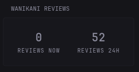
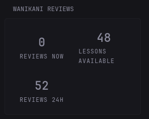

# Wanikani Reviews Widget

Small widget that shows your Wanikani reviews (and next 24 hours) (and lessons)





## Environment Variables
`WANIKANI_API_KEY` - Your (read-only) Wanikani API key, you can get this from the website under settings.

## Settings
You can set lessons to true or false, depending on whether you want to see the number of lessons available. 

This does not show the number as on the website, but rather the actual total.


## Code
```yaml
- type: custom-api
  title: Wanikani reviews
  frameless: false
  cache: 5m
  options:
    api-base-url: "https://api.wanikani.com/v2"
    api-key: ${WANIKANI_API_KEY}
    lessons: false
  template: |
    {{ $apiBaseUrl := .Options.StringOr "api-base-url" "" }}
    {{ $apiKey := .Options.StringOr "api-key" "" }}
    {{ $lessons := .Options.BoolOr "lessons" true }}

    {{ if or (eq $apiBaseUrl "") (eq $apiKey "") }}
      <div class="widget-error-header">
        <div class="color-negative size-h3">ERROR</div>
        <p class="break-all">Missing Wanikani URL or API key.</p>
      </div>
    {{ else }}
      {{ $summaryUrl := printf "%s/summary" (trimSuffix "/" $apiBaseUrl) }}

      {{ $summaryResponse := newRequest $summaryUrl
          | withHeader "Accept" "application/json"
          | withHeader "Wanikani-Revision" "20170710"
          | withHeader "Authorization" (printf "Bearer %s" $apiKey)
          | getResponse }}

      {{ $reviewsNowCount := 0 }}
      {{ $reviewsUpcomingCount := 0 }}
      {{ $reviewIndex := 0 }}
      {{ range $summaryResponse.JSON.Array "data.reviews" }}
        {{ if eq $reviewIndex 0 }}
          {{ $reviewsNowCount = len (.Array "subject_ids") }}
        {{ else }}
          {{ $reviewsUpcomingCount = add $reviewsUpcomingCount (len (.Array "subject_ids")) }}
        {{ end }}
        {{ $reviewIndex = add $reviewIndex 1 }}
      {{ end }}

      {{ $lessonsTotal := 0 }}
      {{ $lessonsUpcomingCount := 0 }}
      {{ $lessonIndex := 0 }}
      {{ range $summaryResponse.JSON.Array "data.lessons" }}
        {{ $lessonsTotal = add $lessonsTotal (len (.Array "subject_ids")) }}
        {{ if ne $lessonIndex 0 }}
          {{ $lessonsUpcomingCount = add $lessonsUpcomingCount (len (.Array "subject_ids")) }}
        {{ end }}
        {{ $lessonIndex = add $lessonIndex 1 }}
      {{ end }}

      <div style="display:grid; grid-template-columns:repeat(2, minmax(0,1fr)); gap:1rem; min-height:8rem;">
        <div style="display:flex; flex-direction:column; align-items:center; justify-content:center; padding:0.75rem; border-radius:0.75rem; background:var(--surface-secondary);">
          <div style="font-size:2.5rem; font-weight:700;">{{ $reviewsNowCount }}</div>
          <div style="text-transform:uppercase; letter-spacing:0.08em; color:var(--color-subdue);">Reviews now</div>
        </div>
        {{ if $lessons }}
        <div style="display:flex; flex-direction:column; align-items:center; justify-content:center; padding:0.75rem; border-radius:0.75rem; background:var(--surface-secondary);">
          <div style="font-size:2.5rem; font-weight:700;">{{ $lessonsTotal }}</div>
          <div style="text-transform:uppercase; letter-spacing:0.08em; color:var(--color-subdue);">Lessons available</div>
        </div>
        {{ end }}
        <div style="display:flex; flex-direction:column; align-items:center; justify-content:center; padding:0.75rem; border-radius:0.75rem; background:var(--surface-secondary);">
          <div style="font-size:2.5rem; font-weight:700;">{{ $reviewsUpcomingCount }}</div>
          <div style="text-transform:uppercase; letter-spacing:0.08em; color:var(--color-subdue);">Reviews 24h</div>
        </div>
      </div>
    {{ end }}
```